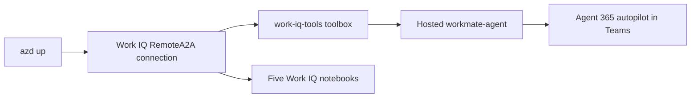

# Microsoft IQ Deep Dive: Work IQ (with Python)

Day 2 of the **Microsoft IQ Deep Dive** series — a companion to
[pamelafox/iqdeepdive-foundryiq](https://github.com/pamelafox/iqdeepdive-foundryiq).

- **July 28 — Foundry IQ** ([Pamela Fox](https://github.com/pamelafox/iqdeepdive-foundryiq))
- **July 29 — Work IQ** (this repo, [@aycabas](https://github.com/aycabas))
- **July 30 — Fabric IQ**

Where Foundry IQ answers *"what do our documents/policies say?"* from a knowledge base,
**Work IQ** answers *"what does **my** workday look like — and act on it"* from the signed-in
user's own Microsoft 365 work context (email, meetings, files, chats, people). Same Contoso
world as Pamela's HR agent, but from the **employee's** point of view — and it can **take
action** (draft and send follow-ups) via `do_action`, which a knowledge base cannot.

This repo combines a five-part Work IQ notebook lab with one deployable
[Microsoft Agent Framework](https://learn.microsoft.com/agent-framework/) agent —
**`workmate-agent`** — a Contoso "navigate my day" assistant that mounts Work IQ as a Foundry
**toolbox** and ships as an **Agent 365 autopilot** (digital worker) in Microsoft Teams.



## What Work IQ is

Work IQ is Microsoft 365's AI-native **work intelligence** layer. Every request runs in the
context of the signed-in user and honors all Microsoft 365 permissions and sensitivity labels.

| Concept | Detail |
|---------|--------|
| Gateway | `workiq.svc.cloud.microsoft` |
| Token audience | `api://workiq.svc.cloud.microsoft` |
| Delegated scope | `WorkIQAgent.Ask` + `offline_access` |
| Work IQ app ID | `fdcc1f02-fc51-4226-8753-f668596af7f7` |
| Access protocols | **A2A** (JSON-RPC agent peer), **MCP** (10 generic verbs), **REST** (Copilot Chat API) |
| Write path | `do_action` (MCP) — the only way to trigger side effects (send mail, create event) |
| Per user | Microsoft 365 Copilot license required |

## Repo layout

```
notebooks/            Five-part Work IQ lab (parts 1–5)
src/workmate-agent/   The hosted agent: main.py + workiq_consent.py (Work IQ toolbox, MAF)
infra/                setup-env.py + create-workiq-toolbox.py + postprovision hooks
docs/teams.md         Publishing workmate-agent as an Agent 365 autopilot
slides/               The talk deck
```

The agent is intentionally two hand-written files — `main.py` builds a MAF `Agent` over a
`FoundryChatClient` and a `FoundryToolbox` (the `work-iq-tools` toolbox), and `workiq_consent.py`
teaches the MAF host to surface Work IQ's OAuth consent prompt.

## Prerequisites

- An Azure subscription with permission to create resources and role assignments
- [Azure Developer CLI](https://learn.microsoft.com/azure/developer/azure-developer-cli/install-azd)
  with the `azure.ai.agents` extension
- [uv](https://docs.astral.sh/uv/getting-started/installation/) and Python 3.12+
- An existing (or newly created) Foundry project with a `gpt-5.4`-class model, **not**
  VNet-restricted (Work IQ does not support VNet integration)
- **A Microsoft 365 Copilot license** on your test user (propagation takes 15–30 min)
- An **Entra Global Administrator** for the one-time Work IQ admin-consent — see
  [`ADMIN_SETUP.md`](ADMIN_SETUP.md)

## Provision

```shell
azd up
```

`azd up` binds to the Foundry project, then the postprovision hook runs
`infra/create-workiq-toolbox.py`: it creates the Work IQ Entra app + `RemoteA2A` connection +
the **`work-iq-tools` toolbox**, and writes settings to `.env`. Then `azd deploy workmate-agent`
ships the hosted agent.

## Run the notebooks (in order)

```shell
uv sync --locked --all-groups
uv pip install --python .venv/bin/python -r notebooks/requirements.txt
```

Open `notebooks/` in VS Code, select `.venv`, and run:

1. `part1-workiq-api-concepts.ipynb` — gateway, auth, `ask` / `fetch` / `search_paths` / `get_schema`
2. `part2-workiq-a2a.ipynb` — the A2A agent card, discovery, JSON-RPC calls
3. `part3-workiq-mcp.ipynb` — the 10 MCP verbs and runtime `get_schema`
4. `part4-workiq-tools-actions.ipynb` — `do_action`, the only write path (send a follow-up mail)
5. `part5-workiq-in-maf-agent.ipynb` — Work IQ inside a Microsoft Agent Framework agent

## Run and invoke the workmate agent

```shell
azd deploy workmate-agent
azd ai agent invoke workmate-agent "What did my manager email me about this week, and draft a reply?"
```

## Ship it as an Agent 365 autopilot

A hosted Foundry agent comes with its own **agent identity (blueprint id)**, so it needs no
bespoke blueprint/bot scripts. Deploy with `azd`, then an admin onboards it as a digital worker
from the **Agent 365 admin portal** (Microsoft 365 admin center) using that blueprint identity.
Note: Foundry's own **Publish** button only creates a **Teams agent app** — that's the path
Pamela's Foundry IQ agent demos. The **Agent 365 autopilot / digital worker** onboarding is a
separate admin step outside Foundry. In Teams, Work IQ runs **on-behalf-of the signed-in user**,
and `do_action` lets it take action in that user's Microsoft 365 (always after showing a draft).
See [`docs/teams.md`](docs/teams.md).

## Slides

The talk deck lives in [`slides/`](slides/) — built in the same style as the Foundry IQ deck.

## Attribution

Repo shape and series branding adapted from
[pamelafox/iqdeepdive-foundryiq](https://github.com/pamelafox/iqdeepdive-foundryiq).
Work IQ client patterns adapted from the official Work IQ samples. See [ATTRIBUTION.md](ATTRIBUTION.md).
