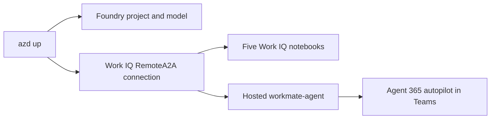

# Microsoft IQ Deep Dive: Work IQ (with Python)

Day 2 of the **Microsoft IQ Deep Dive** series — a companion to
[pamelafox/iqdeepdive-foundryiq](https://github.com/pamelafox/iqdeepdive-foundryiq).

- **July 28 — Foundry IQ** ([Pamela Fox](https://github.com/pamelafox/iqdeepdive-foundryiq))
- **July 29 — Work IQ** (this repo, [@aycabas](https://github.com/aycabas))
- **July 30 — Fabric IQ**

Where Foundry IQ answers *"what do our documents/policies say?"* from a knowledge base,
**Work IQ** answers *"what does **my** workday look like — and act on it"* from the signed-in
user's own Microsoft 365 work context (email, meetings, files, chats, people). Same Contoso
world as Pamela's HR agent, but from the **employee's** point of view — and it can **take
action** (draft and send follow-ups) via `do_action`, which a knowledge base cannot.

This repo combines a five-part Work IQ notebook lab with one deployable
[Microsoft Agent Framework](https://learn.microsoft.com/agent-framework/) agent —
**`workmate-agent`** — a Contoso "navigate my day" assistant that deploys as an **Agent 365 autopilot** (digital worker) in Microsoft Teams.



## What Work IQ is

Work IQ is Microsoft 365's AI-native **work intelligence** layer. Every request runs in the
context of the signed-in user and honors all Microsoft 365 permissions and sensitivity labels.

| Concept | Detail |
|---------|--------|
| Gateway | `workiq.svc.cloud.microsoft` |
| Token audience | `api://workiq.svc.cloud.microsoft` |
| Delegated scope | `WorkIQAgent.Ask` + `offline_access` |
| Work IQ app ID | `fdcc1f02-fc51-4226-8753-f668596af7f7` |
| Access protocols | **A2A** (JSON-RPC agent peer), **MCP** (10 generic verbs), **REST** (Copilot Chat API) |
| Write path | `do_action` (MCP) — the only way to trigger side effects (send mail, create event) |
| Per user | Microsoft 365 Copilot license required |

## Prerequisites

- An Azure subscription with permission to create resources and role assignments
- [Azure Developer CLI](https://learn.microsoft.com/azure/developer/azure-developer-cli/install-azd)
  with the `azure.ai.agents` extension
- [uv](https://docs.astral.sh/uv/getting-started/installation/) and Python 3.12+
- Quota in one region for Foundry hosted agents and `gpt-5.4`
- **A Microsoft 365 Copilot license** on your test user (propagation takes 15–30 min)
- An **Entra app registration** with `WorkIQAgent.Ask` admin-consented — see
  [`ADMIN_SETUP.md`](ADMIN_SETUP.md)
- The Foundry project must **not** be VNet-restricted (Work IQ does not support VNet integration)

## Provision

```shell
azd up
```

`azd up` provisions the Foundry project + `gpt-5.4`, creates the **Work IQ `RemoteA2A`
connection**, writes generated settings to `.env`, and deploys `workmate-agent`.

## Run the notebooks (in order)

```shell
uv sync --locked --all-groups
uv pip install --python .venv/bin/python -r notebooks/requirements.txt
```

Open `notebooks/` in VS Code, select `.venv`, and run:

1. `part1-workiq-api-concepts.ipynb` — gateway, auth, `ask` / `fetch` / `search_paths` / `get_schema`
2. `part2-workiq-a2a.ipynb` — the A2A agent card, discovery, JSON-RPC calls
3. `part3-workiq-mcp.ipynb` — the 10 MCP verbs and runtime `get_schema`
4. `part4-workiq-tools-actions.ipynb` — `do_action`, the only write path (send a follow-up mail)
5. `part5-workiq-in-maf-agent.ipynb` — Work IQ inside a Microsoft Agent Framework agent

## Run and invoke the workmate agent

```shell
azd ai agent run
azd ai agent invoke --local "What did my manager email me about this week, and draft a reply?"

azd deploy workmate-agent
azd ai agent invoke workmate-agent "Summarize my meetings today and flag anything I owe a follow-up on"
```

## Ship it as an Agent 365 autopilot

The hosted `workmate-agent` publishes as an **Agent 365 autopilot** (a digital worker)
in Microsoft Teams. The [`deploy/`](deploy/) scripts do this against an **existing**
Foundry project (reusing its Work IQ connection + model + registry — no new
account/project), creating just two new resources: the agent-identity **blueprint**
and an **Azure Bot + Teams channel** transport. In Teams, Work IQ runs
**on-behalf-of the signed-in user**, and `do_action` lets the autopilot take action in
that user's Microsoft 365 — always after showing a draft for confirmation. See
[`deploy/README.md`](deploy/README.md) and [`docs/teams.md`](docs/teams.md) for the
ordered steps, the blueprint-vs-bot explanation, and Teams auth troubleshooting.

## Slides

The talk deck lives in [`slides/`](slides/) — built in the same style as the Foundry IQ deck.

## Attribution

Repo shape and series branding adapted from
[pamelafox/iqdeepdive-foundryiq](https://github.com/pamelafox/iqdeepdive-foundryiq).
Work IQ client patterns adapted from the official Work IQ samples. See [ATTRIBUTION.md](ATTRIBUTION.md).
