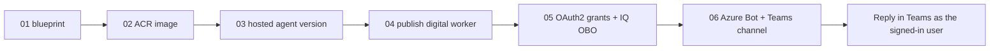

# Deploy `workmate` as an Agent 365 autopilot (digital worker) in Teams

These scripts take the hosted `workmate` agent from source to a **Microsoft Teams
digital worker** that answers **on-behalf-of the signed-in user** through Work IQ.

## Design: reuse an existing Foundry project

Unlike a full `azd up` (which provisions a fresh account + project + registry),
this flow runs the agent **inside an existing Foundry project**
(`4iq-foundry-project`) and **reuses** its Work IQ connection, its `gpt-5.4-mini`
model, and an existing Azure Container Registry. Only **two** new resources are
created: the agent-identity **blueprint** and the **Azure Bot** (Teams transport).



## Why both a blueprint **and** a bot?

They are complementary, not redundant:

- **Blueprint** = the agent's Entra **identity** (auth + on-behalf-of exchange).
  The hosted agent references it; Foundry auto-creates the per-instance identity.
- **Azure Bot** = the Teams **transport**. It registers the blueprint's app id
  (`msaAppId`) against the agent's activity-protocol endpoint and turns on the
  Teams channel. Without it, Teams has nowhere to deliver messages and the worker
  never replies. (Verified: deleting the bot silently breaks Teams routing.)

## Prerequisites

- `az login` into the target tenant, with rights to create role assignments,
  bot services, and — for step 05 — tenant-wide OAuth2 grants (admin).
- The target Foundry project already has a **Work IQ** connection and the model.
- The reused ACR's `AcrPull` is granted to the project/account managed identity
  (one-time: `az role assignment create --assignee-object-id <accountPrincipalId>
  --role AcrPull --scope <acrId>`).
- Test users need a **Microsoft 365 Copilot license** (15–30 min to propagate).

## Steps

```powershell
cd deploy
Copy-Item config.sample.ps1 config.ps1   # then edit config.ps1

# 1) Create the blueprint; copy the printed clientId into config.ps1 -> BlueprintClientId
./01-create-blueprint.ps1

# 2) Build + push the image (reuses the ACR)
./02-build-image.ps1

# 3) Create the hosted agent version; note the printed Agent GUID
./03-create-agent.ps1

# 4) Publish as a digital worker (pass the GUID from step 3)
./04-publish-digital-worker.ps1 -AgentGuid <agent-guid>

# 5) OAuth2 grants (Agent 365 MCP + APEX + IQ OBO) — admin consent
./05-create-oauth-grants.ps1

# 6) Azure Bot + Teams channel
./06-create-bot.ps1
```

Then open the published **Workmate** digital worker in Teams and try:

- "What did my manager email me about this week? Draft a reply I can review."
- "Any action items waiting on me across email and Teams?"
- "Find the latest deck someone shared with me and tell me who last edited it."

## Troubleshooting Teams auth

Hosted A365 Work IQ auth is finicky. If Teams stays silent or Work IQ errors:

- **AADSTS65001 / consent** on `graph.microsoft.com/.default` or
  `ai.azure.com/.default` for the blueprint SP → re-run step 05 (grants).
- **`requires a signed-in user`** from Work IQ → the OBO isn't flowing; confirm
  the IQ OBO grants (Cognitive Services + Azure ML `user_impersonation`) exist and
  the caller has a Copilot license.
- **403 on `openai/responses`** → grant the agent's instance identity **Cognitive
  Services User** on the account (step 03 does this) and confirm the agentic user
  has access to the project.
- **No reply at all** → the Azure Bot or its Teams channel is missing/mispointed
  (step 06); check `msaAppId` == blueprint clientId and the endpoint URL.
