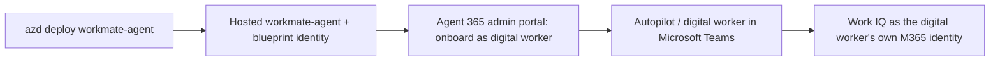

# Shipping `workmate-agent` as an Agent 365 autopilot

Work IQ always runs in a **user identity's** context — there is no app-only mode. What changes
between surfaces is *whose* identity:

- **Foundry playground** — the agent acts **on behalf of the signed-in developer** (you). Work IQ
  answers about *your* mail, meetings, and files. This is the surface used to build and demo the
  agent. (Verified: the playground returns the developer's own mailbox.)
- **Teams, as an Agent 365 digital worker** — the autopilot acts **as itself**: it has its own
  digital-worker identity and its own Microsoft 365 mailbox/context, and Work IQ answers about
  *the worker's* data, **not** the Teams user's. The digital worker is a first-class M365 identity,
  not an on-behalf-of proxy for whoever is chatting with it.

Pamela's Foundry IQ agent demos **Publish to Teams** (a Teams app that runs on-behalf-of the
signed-in user). Because our `workmate-agent` is a Work IQ **digital worker** (acting as itself),
we demo the **Agent 365 autopilot** path instead.

## Why this needs no bespoke deploy scripts

A hosted Foundry agent (`host: azure.ai.agent`) is provisioned with its own **agent identity /
blueprint id** — an Entra identity (a `ManagedAgentIdentityBlueprint`) Foundry uses for
on-behalf-of token exchange. That identity is exactly what an Agent 365 digital worker needs, so
there is **no hand-rolled blueprint/bot/publish pipeline in this repo** anymore. You deploy the
agent with `azd`, then an admin onboards it as a digital worker from the **Agent 365 admin
portal** — not from Foundry.

> Foundry's own **Publish** button only creates a **Teams agent app** (this is what Pamela's
> Foundry IQ agent demos). The **Agent 365 autopilot / digital worker** path is a separate
> onboarding done by an admin in the Microsoft 365 / Agent 365 admin portal against the agent's
> blueprint identity.

## Steps

1. **Deploy the agent:** `azd deploy workmate-agent`. Confirm it runs in the Foundry playground
   as your signed-in user (Work IQ answers about *your* mail/meetings). Note the agent's
   **Blueprint Client ID** from `azd ai agent show workmate-agent`.
2. **Onboard it as an Agent 365 digital worker:** in the **Agent 365 admin portal** (Microsoft
   365 admin center), an admin registers/onboards the agent as a digital worker (autopilot) using
   that blueprint identity. This is *not* the Foundry **Publish** button — that only produces a
   Teams agent app.
3. **Chat with it in Teams:** the autopilot appears as a digital worker; it runs Work IQ **as its
   own M365 identity** (its own mailbox/context), not on behalf of the person chatting with it.

## What the autopilot still needs for Work IQ

- The **digital worker's own identity** needs a **Microsoft 365 Copilot license** (it acts as
  itself, so its own mailbox/context is what Work IQ reads; propagation takes 15–30 min).
- The `work-iq-tools` toolbox + `RemoteA2A` connection must exist in the project
  (created by `infra/create-workiq-toolbox.py` during `azd up`).
- The agent's instance identity needs **Cognitive Services User** on the Foundry account (azd's
  `provision` normally assigns this; grant it manually when deploying into an existing project).
- The Foundry project must **not** be VNet-restricted (Work IQ does not support VNet integration).

## Demo prompts

In the **Foundry playground** the agent answers as **you**:

- "How many unread emails do I have, and who are the top 3 senders?"
- "What did my manager email me about this week? Draft a reply I can review."
- "Find the latest deck on the Contoso launch and tell me who last edited it."

In **Teams** the same prompts answer about the **digital worker's own** mailbox and context.
Because Work IQ writes go through `do_action`, the agent shows a draft first and only sends
after you confirm.
