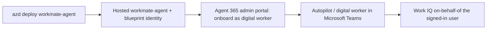

# Shipping `workmate-agent` as an Agent 365 autopilot

Work IQ always runs in the **signed-in user's** context. A Foundry hosted agent called with an
app or managed identity gets `requires a signed-in user`, so the two paths that actually work are
the signed-in Foundry playground and — for real end users — publishing the agent so the caller's
token flows on-behalf-of and Work IQ answers as *that* person.

Pamela's Foundry IQ agent demos **Publish to Teams** (a Teams app). Because our `workmate-agent`
is a Work IQ digital worker, we demo the **Agent 365 autopilot** path instead.

## Why this needs no bespoke deploy scripts

A hosted Foundry agent (`host: azure.ai.agent`) is provisioned with its own **agent identity /
blueprint id** — an Entra identity (a `ManagedAgentIdentityBlueprint`) Foundry uses for
on-behalf-of token exchange. That identity is exactly what an Agent 365 digital worker needs, so
there is **no hand-rolled blueprint/bot/publish pipeline in this repo** anymore. You deploy the
agent with `azd`, then an admin onboards it as a digital worker from the **Agent 365 admin
portal** — not from Foundry.

> Foundry's own **Publish** button only creates a **Teams agent app** (this is what Pamela's
> Foundry IQ agent demos). The **Agent 365 autopilot / digital worker** path is a separate
> onboarding done by an admin in the Microsoft 365 / Agent 365 admin portal against the agent's
> blueprint identity.

## Steps

1. **Deploy the agent:** `azd deploy workmate-agent`. Confirm it runs in the Foundry playground
   as your signed-in user (Work IQ answers about *your* mail/meetings). Note the agent's
   **Blueprint Client ID** from `azd ai agent show workmate-agent`.
2. **Onboard it as an Agent 365 digital worker:** in the **Agent 365 admin portal** (Microsoft
   365 admin center), an admin registers/onboards the agent as a digital worker (autopilot) using
   that blueprint identity. This is *not* the Foundry **Publish** button — that only produces a
   Teams agent app.
3. **Chat with it in Teams:** the autopilot appears as a digital worker; messages run Work IQ
   on-behalf-of the Teams user.

## What the autopilot still needs for Work IQ

- Each Teams user needs a **Microsoft 365 Copilot license** (propagation takes 15–30 min).
- The `work-iq-tools` toolbox + `RemoteA2A` connection must exist in the project
  (created by `infra/create-workiq-toolbox.py` during `azd up`).
- The Foundry project must **not** be VNet-restricted (Work IQ does not support VNet integration).

## Demo prompts (Teams)

- "What did my manager email me about this week? Draft a reply I can review."
- "Summarize my meetings today and flag anything I owe a follow-up on."
- "Find the latest deck on the Contoso launch and tell me who last edited it."

Because Work IQ writes go through `do_action`, the autopilot shows a draft first and only sends
after you confirm.
