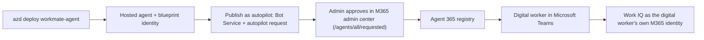

# Shipping `workmate-agent` as an Agent 365 autopilot

Work IQ always runs in a **user identity's** context — there is no app-only mode. What changes
between surfaces is *whose* identity:

- **Foundry playground** — the agent acts **on behalf of the signed-in developer** (you). Work IQ
  answers about *your* mail, meetings, and files. This is the surface used to build and demo the
  agent. (Verified: the playground returns the developer's own mailbox.)
- **Teams, as an Agent 365 digital worker** — the autopilot acts **as itself**: it has its own
  digital-worker identity and its own Microsoft 365 mailbox/context, and Work IQ answers about
  *the worker's* data, **not** the Teams user's. The digital worker is a first-class M365 identity,
  not an on-behalf-of proxy for whoever is chatting with it.

Pamela's Foundry IQ agent demos **Publish to Teams** (a Teams app that runs on-behalf-of the
signed-in user). Because our `workmate-agent` is a Work IQ **digital worker** (acting as itself),
we demo the **Agent 365 autopilot** path instead.

## From hosted agent to Agent 365 digital worker

A hosted Foundry agent (`host: azure.ai.agent`) is provisioned with its own **agent identity /
blueprint id** (a `ManagedAgentIdentityBlueprint`). That covers *identity*, but becoming a Teams
digital worker also requires **registering the agent in the Agent 365 registry** — which our
`azd deploy` does **not** do on its own. Publishing an autopilot additionally provisions an
**Azure Bot Service** (the Teams transport) and submits an **autopilot request** that creates a
pending blueprint in the Microsoft 365 admin center for **admin approval**.

> Foundry's plain **Publish** button (Teams agent app) is *not* the same as publishing an
> **Agent 365 autopilot**. The autopilot path is what registers the digital worker; it is
> documented in [Publish an autopilot in Microsoft Agent 365](https://learn.microsoft.com/azure/foundry/agents/how-to/agent-365).

## Steps

1. **Deploy the agent:** `azd deploy workmate-agent`. Confirm it runs in the Foundry playground
   as your signed-in user (Work IQ answers about *your* mail/meetings). Note the agent's
   **Blueprint Client ID** from `azd ai agent show workmate-agent`.
2. **Register `Microsoft.BotService`** (once per subscription) if needed:
   `az provider register --namespace Microsoft.BotService`.
3. **Publish as an autopilot:** from Foundry, publish the hosted agent as an **Agent 365
   autopilot**. This provisions the **Azure Bot Service** transport and submits the **autopilot
   request** that creates a pending blueprint in the Microsoft 365 admin center. (The end-to-end
   reference automation is the
   [FoundryA365 sample](https://github.com/microsoft-foundry/foundry-samples/tree/main/samples/csharp/foundry-autopilot-agent).)
4. **Admin approval:** an **AI Administrator / Global Administrator** approves the pending request
   at [admin.cloud.microsoft/#/agents/all/requested](https://admin.cloud.microsoft/?#/agents/all/requested).
   After approval the agent appears in the **Agent 365 registry**.
5. **Verify + use in Teams:** confirm the blueprint's messaging endpoint + app id in the
   [Teams Developer Portal](https://dev.teams.microsoft.com/apps), then in Teams go to
   **Apps → Agents for your team**, find the agent, and create an instance. It runs Work IQ **as
   its own M365 identity** (its own mailbox), not on behalf of the person chatting with it.

## What the autopilot still needs for Work IQ

- The **digital worker's own identity** needs a **Microsoft 365 Copilot license** (it acts as
  itself, so its own mailbox/context is what Work IQ reads; propagation takes 15–30 min).
- The `work-iq-tools` toolbox + `RemoteA2A` connection must exist in the project
  (created by `infra/create-workiq-toolbox.py` during `azd up`).
- The agent's instance identity needs **Cognitive Services User** on the Foundry account (azd's
  `provision` normally assigns this; grant it manually when deploying into an existing project).
- The Foundry project must **not** be VNet-restricted (Work IQ does not support VNet integration).

## Demo prompts

In the **Foundry playground** the agent answers as **you**:

- "How many unread emails do I have, and who are the top 3 senders?"
- "What did my manager email me about this week? Draft a reply I can review."
- "Find the latest deck on the Contoso launch and tell me who last edited it."

In **Teams** the same prompts answer about the **digital worker's own** mailbox and context.
Because Work IQ writes go through `do_action`, the agent shows a draft first and only sends
after you confirm.
