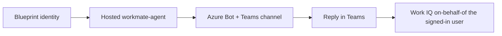

# Shipping `workmate-agent` as an Agent 365 autopilot

Work IQ runs in the **signed-in user's** context. A Foundry hosted agent invoked with an app or
managed identity gets `requires a signed-in user`. The reliable user-context paths are the signed-in
Foundry playground and — for real users — publishing the agent as an **Agent 365 autopilot**
(digital worker) in Microsoft Teams, where the caller's token flows on-behalf-of so Work IQ (and
`do_action`) work.

## Publishing the autopilot (blueprint + bot)

Shipping the hosted agent to Teams takes a short, repeatable pipeline — the scripts
in [`deploy/`](../deploy/) do it against an **existing** Foundry project (no new
account/project provisioned). Two new resources are created:

- an **agent-identity blueprint** — the agent's Entra identity (auth + on-behalf-of
  exchange), referenced by the hosted agent version, and
- an **Azure Bot + Teams channel** — the transport that registers the blueprint's
  app id against the agent's activity-protocol endpoint so Teams can reach it.

They are complementary: the blueprint is *who the agent is*, the bot is *how Teams
delivers messages to it*. Skipping the bot means Teams has nowhere to deliver to and
the worker never replies (verified: deleting the bot silently breaks routing).

See [`deploy/README.md`](../deploy/README.md) for the exact ordered steps and
troubleshooting.

## What the autopilot still needs for Work IQ

For the autopilot to call Work IQ on-behalf-of the Teams user:

- Each Teams user needs a **Microsoft 365 Copilot license** (propagation takes 15-30 min).
- The blueprint SP must have the **IQ OBO** grants (`user_impersonation` on
  Microsoft Cognitive Services + Azure Machine Learning) so Foundry resolves the
  Work IQ connection as the signed-in user — `deploy/05-create-oauth-grants.ps1`.
- The agent's instance identity needs **Cognitive Services User** on the account
  (`deploy/03-create-agent.ps1`).
- The Foundry project must **not** be VNet-restricted (Work IQ does not support VNet integration).

## Demo prompts (Teams)

- "What did my manager email me about this week? Draft a reply I can review."
- "Summarize my meetings today and flag anything I owe a follow-up on."
- "Find the latest deck on the Contoso launch and tell me who last edited it."

The autopilot shows a draft first; on your confirmation it sends via Work IQ `do_action`.
